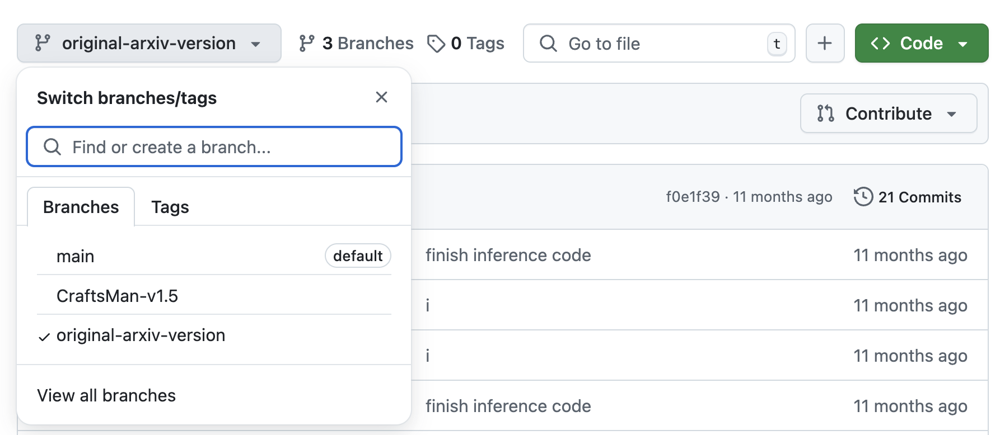

#### Important: we released [CraftsMan3D-DoraVAE](https://aruichen.github.io/Dora/) trained using rectified flow.

[中文版](README_zh.md)
<p align="center">
  
</p>

### <div align="center">CraftsMan3D: High-fidelity Mesh Generation <br> with 3D Native Generation and Interactive Geometry Refiner<div> 
#####  <p align="center"> [Weiyu Li<sup>*1,2</sup>](https://wyysf-98.github.io/), Jiarui Liu<sup>*1,2</sup>, Hongyu Yan<sup>*1</sup>, [Rui Chen<sup>1</sup>](https://aruichen.github.io/), [Yixun Liang<sup>1,2</sup>](https://yixunliang.github.io/), [Xuelin Chen<sup>3</sup>](https://xuelin-chen.github.io/), [Ping Tan<sup>1,2</sup>](https://ece.hkust.edu.hk/pingtan), [Xiaoxiao Long<sup>1,2</sup>](https://www.xxlong.site/)</p>
#####  <p align="center"> <sup>1</sup>HKUST, <sup>2</sup>LightIllusions, <sup>3</sup>Adobe Research</p>
<div align="center">
  <a href="https://craftsman3d.github.io/"></a> &ensp;
  <a href="https://huggingface.co/spaces/wyysf/CraftsMan"></a> &ensp;
  <a href="https://triverse.lightillusions.com/">Local Website</a> &ensp;
  <a href="https://arxiv.org/pdf/2405.14979"></a> &ensp;
</div>

# Usage

```
from craftsman import CraftsManPipeline
import torch

# load from local ckpt
# pipeline = CraftsManPipeline.from_pretrained("./ckpts/craftsman-DoraVAE", device="cuda:0", torch_dtype=torch.bfloat16) 

# load from huggingface model hub
pipeline = CraftsManPipeline.from_pretrained("craftsman3d/craftsman-DoraVAE", device="cuda:0", torch_dtype=torch.bfloat16)

# inference
mesh = pipeline("https://pub-f9073a756ec645d692ce3d171c2e1232.r2.dev/data/werewolf.png").meshes[0]
mesh.export("werewolf.obj")

```

The results should be like this:
<p align="center">
  
</p>


#### TL; DR: <font color="red">**CraftsMan3D (aka 匠心)**</font> is a two-stage text/image to 3D mesh generation model. By mimicking the modeling workflow of artist/craftsman, we propose to generate a coarse mesh (5s) with smooth geometry using 3D diffusion model and then refine it (20s) using enhanced multi-view normal maps generated by 2D normal diffusion, which is also can be in a interactive manner like Zbrush.


## ✨ Overview

This repo contains source code (training / inference) of 3D diffusion model, pretrained weights and gradio demo code of our 3D mesh generation project, you can find more visualizations on our [project page](https://craftsman3d.github.io/) and try our [demo](http://algodemo.bj.lightions.top:24926). If you have high-quality 3D data or some other ideas, we very much welcome any form of cooperation.
<details><summary>Full abstract here</summary>
We present a novel generative 3D modeling system, coined CraftsMan, which can generate high-fidelity 3D geometries with highly varied shapes, regular mesh topologies, and detailed surfaces, and, notably, allows for refining the geometry in an interactive manner. Despite the significant advancements in 3D generation, existing methods still struggle with lengthy optimization processes, irregular mesh topologies, noisy surfaces, and difficulties in accommodating user edits, consequently impeding their widespread adoption and implentation in 3D modeling softwares. Our work is inspired by the craftsman, who usually roughs out the holistic figure of the work first and elaborate the surface details subsequently. Specifically, we employ a 3D native diffusion model, which operates on latent space learned from latent set-based 3D representations, to generate coarse geometries with regular mesh topology in seconds. In particular, this process takes as input a text prompt or a reference image, and leverages a powerful multi-view (MV) diffusion model to generates multiple views of the coarse geometry, which are fed into our MV-conditioned 3D diffusion model for generating the 3D geometry, significantly improving robustness and generalizability. Following that, a normal-based geometry refiner is used to significantly enhance the surface details. This refinement can be performed automatically, or interactively with user-supplied edits. Extensive experiments demonstrate that our method achieves high efficiency in producing superior quality 3D assets compared to existing methods.
</details>

<p align="center">
  
</p>

# 💪 ToDo List

- [x] Inference code
- [x] Training code
- [x] Gradio & Hugging Face demo
- [x] Model zoo
- [x] Environment setup
- [x] Data sample
- [x] CraftsMan3D-DoraVAE
- [x] support rectified flow training
- [ ] release multiview(4 views) conditioned model (including weights and training data sample) 
- [ ] add data sample for vae training
- [ ] support training and finetuning TripoSG model (almost done)
- [ ] support training Hunyuan3D-2 model(it is not release the weights for vae encoder)


## Contents
* [Pretrained Models](##-Pretrained-models)
* [Gradio & Huggingface Demo](#Gradio-demo)
* [Inference](#Inference)
* [Training](#Train)
* [Data Prepration](#data)
* [Video](#Video)
* [Acknowledgement](#Acknowledgements)
* [Citation](#Bibtex)

## Environment Setup

<details> <summary>Hardware</summary>
We train our model on 32x A800 GPUs with a batch size of 32 per GPU for 7 days.

The mesh refinement part is performed on a GTX 3080 GPU.


</details>
<details> <summary>Setup environment</summary>

:smiley: We also provide a Dockerfile for easy installation, see [Setup using Docker](./docker/README.md).

 - Python 3.10.0
 - PyTorch 2.3.0
 - Cuda Toolkit 12.1.0
 - Ubuntu 22.04

Clone this repository.

```sh
git clone https://github.com/wyysf-98/CraftsMan.git
```

Install the required packages.

```sh
conda create -n CraftsMan python=3.10 -y
conda activate CraftsMan
conda install -c "nvidia/label/cuda-12.1.1" cudatoolkit
# conda install -y pytorch==2.3.1 torchvision==0.18.1 torchaudio==2.3.1 -c pytorch -c nvidia
pip install -y pytorch==2.3.1 torchvision==0.18.1 torchaudio==2.3.1
pip install -r docker/requirements.txt
pip install torch-cluster -f https://data.pyg.org/whl/torch-2.3.1+cu121.html

```

</details>


## ✨ History

This repo will port some recent techniques for 3D diffusion model and the history version like the arxiv version can be found in different branch.

<p align="center">
  
</p>


# 🎥 Video

[](https://www.youtube.com/watch?v=WhEs4tS4mGo)


# 3D Native DiT Model (Latent Set DiT Model)
We provide the training and the inference code here for future research.
The latent set VAE model is heavily build on the same structure of [Michelangelo](https://github.com/NeuralCarver/Michelangelo).
The latent set diffusion model is based on a [DiT/Pixart-alpha](https://pixart-alpha.github.io/) and with 500M parameters.

## Pretrained models
Currently, We provide the [models](https://huggingface.co/wyysf/CraftsMan) with single view image as condition with DiT.
We will consider open source the further models according to the real situation.
If you run the ``inference.py`` without specifying the model path, it will automatically download the model from the huggingface model hub.

Or you can download the model manually:
```bash
## you can just manually get the model using wget:
mkdir ckpts
cd ckpts
mkdir craftsman-v1-5
cd craftsman-v1-5
wget https://huggingface.co/craftsman3d/craftsman/resolve/main/config.yaml
wget https://huggingface.co/craftsman3d/craftsman/resolve/main/model.ckpt
### for DoraVAE version(https://aruichen.github.io/Dora/)
cd ..
mkdir craftsman-doravae
cd craftsman-doravae
wget https://huggingface.co/craftsman3d/craftsman-doravae/resolve/main/config.yaml
wget https://huggingface.co/craftsman3d/craftsman-doravae/resolve/main/model.ckpt

## OR you can git clone the repo:
git lfs install
git clone https://huggingface.co/craftsman3d/craftsman
### for DoraVAE version(https://aruichen.github.io/Dora/)
git clone https://huggingface.co/craftsman3d/craftsman-doravae

```
If you download the models using wget, you should manually put them under the `ckpts/craftsman` directory.

## Gradio demo
We provide gradio demos for easy usage.

```bash
python gradio_app.py --model_path ./ckpts/craftsman
```

## Inference
To generate 3D meshes from images folders via command line, simply run:
```bash
python inference.py --input eval_data --device 0 --model ./ckpts/craftsman
```

For more configs, please refer to the `inference.py`.

## Train from scratch
We provide our training code to facilitate future research. And we provide a data sample in `data`.
100k data sample for VAE training can be downloaded from (to be uploaded)
100k data sample for diffusion training can be downloaded from https://pub-c7137d332b4145b6b321a6c01fcf8911.r2.dev/Objaverse_100k.zip
selected UUID for training can be downloaded from https://pub-c7137d332b4145b6b321a6c01fcf8911.r2.dev/UUID.txt

For more training details and configs, please refer to the `configs` folder.

```bash
### training the shape-autoencoder
python train.py --config ./configs/shape-autoencoder/michelangelo-l768-e64-ne8-nd16.yaml \
                 --train --gpu 0

### training the image-to-shape diffusion model
# for single view conditioned generation
python train.py --config ./configs/image-to-shape-diffusion/clip-dinov2-pixart-diffusion-dit32.yaml --train --gpu 0

# for multi view conditioned generation (original paper)
python train.py --config ./configs/image-to-shape-diffusion/clip-mvrgb-modln-l256-e64-ne8-nd16-nl6.yaml --train --gpu 0

# for DoraVAE single view diffusion version (We can not provide the data for you due to the license issue, you can processed it by yourself)
# (https://github.com/Seed3D/Dora/tree/main/sharp_edge_sampling)
python train.py --config ./configs/image-to-shape-diffusion/DoraVAE-dinov2reglarge518-pixart-rectified-flow-dit32.yaml --train --gpu 0

```


# ❓Common questions
Q: Tips to get better results.
0. Due to limited resources, we will gradually expand the dataset and training scale, and therefore we will release more pre-trained models in the future.
1. Just like the 2D diffusion model, try different seeds, adjust the CFG scale or different scheduler. Good Luck.
2. We will provide a version that conditioned on the text prompt, so you can use some positive and negative prompts.


# 🤗 Acknowledgements

- Thanks to [LightIllusion](https://www.lightillusions.com/) for providing computational resources and Jianxiong Pan for data preprocessing. If you have any idea about high-quality 3D Generation, welcome to contact us!
- Thanks to [Hugging Face](https://github.com/huggingface) for sponsoring the nicely demo!
- Thanks to [3DShape2VecSet](https://github.com/1zb/3DShape2VecSet/tree/master) for their amazing work, the latent set representation provides an efficient way to represent 3D shape!
- Thanks to [Michelangelo](https://github.com/NeuralCarver/Michelangelo) for their great work, our model structure is heavily build on this repo!
- Thanks to [CRM](https://github.com/thu-ml/CRM), [Wonder3D](https://github.com/xxlong0/Wonder3D/) and [LGM](https://github.com/3DTopia/LGM) for their released model about multi-view images generation. If you have a more advanced version and want to contribute to the community, we are welcome to update.
- Thanks to [Objaverse](https://objaverse.allenai.org/), [Objaverse-MIX](https://huggingface.co/datasets/BAAI/Objaverse-MIX/tree/main) for their open-sourced data, which help us to do many validation experiments.
- Thanks to [ThreeStudio](https://github.com/threestudio-project/threestudio) for their great repo, we follow their fantastic and easy-to-use code structure!
- Thanks to [Direct3D](https://github.com/DreamTechAI/Direct3D) especially [Shuang Wu](https://scholar.google.it/citations?user=SN8J78EAAAAJ&hl=zh-CN) for providing their results.
- Thanks to [TripoSG](https://github.com/VAST-AI-Research/TripoSG) and [Hunyuan3D-2](https://github.com/Tencent/Hunyuan3D-2) for their open-source, we adapted our code to support loading their weights, training, and fine-tuning.


# 📑License
CraftsMan3D is under MIT License. 


# 📖 BibTeX

    @misc{li2024craftsman,
    title         = {CraftsMan3D: High-fidelity Mesh Generation with 3D Native Generation and Interactive Geometry Refiner}, 
    author        = {Weiyu Li and Jiarui Liu and Hongyu Yan and Rui Chen and Yixun Liang and Xuelin Chen and Ping Tan and Xiaoxiao Long},
    year          = {2024},
    archivePrefix = {arXiv preprint arXiv:2405.14979},
    primaryClass  = {cs.CG}
    }
